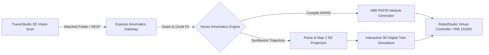

# VertexDynamics: Scan-to-Path Hub

> **RMIT University Engineering Capstone Project 2026**  
> *Automated Optical-to-Kinematic Robotic Arc Welding Trajectory Synthesis & Virtual Commissioning Platform*

[](https://nextjs.org/)
[](https://threejs.org/)
[](https://nodejs.org/)
[](https://new.abb.com/products/robotics)

---

## 1. Executive Summary & Overview

**VertexDynamics Scan-to-Path Hub** is an industrial-grade cyber-physical automation platform designed to bridge optical 3D vision scanning with robotic arc welding automation. 

Traditional robotic welding requires hours of manual teach-pendant jogging and offline point-by-point path programming. The Scan-to-Path Hub automates this entire pipeline by:
1. Ingesting 3D geometric seam descriptors (`Feature.txt`) generated by **TracerStudio**, either from a polled watched folder or by manual import.
2. Fitting the seam geometry — a straight chord, or a circle through three points on an arc.
3. Dynamically computing collision-free approach, weld, and retract trajectories with industrial tool tilt quaternions ($45^\circ$ work angle).
4. Providing real-time 2.5D toolpath visualization and Interactive 3D Digital Twin simulation with simulated arc sparks, torch kinematics, and CAD workpiece assemblies.
5. Compiling syntax-verified **ABB RAPID** module files (`Module1.mod` / `WeldModule.mod`) ready for zero-downtime execution on **ABB IRB 1520ID** industrial robots via **RobotStudio Virtual Controller**.

---

## 2. System Architecture & End-to-End Workflow



### The 5-Step Industrial Pipeline

```
[ Step 1: Projects ]
       │
       ▼
[ Step 2: Acquire ] ──────── (Watched Folder Poll / Manual Feature.txt Import)
       │
       ▼
[ Step 3: Parse & Map ] ──── (2.5D Adaptive Perpendicular Projection)
       │
       ▼
[ Step 4: Generate ] ─────── (Realtime 3D Simulation & RAPID Code Synthesis)
       │
       ▼
[ Step 5: Export & Run ] ─── (Download .mod, Clipboard Copy & RobotStudio Launch)
```

1. **Project Selection**: Select or initialize an active workpiece project and welding recipe.
2. **Acquisition (`Feature.txt`)**: Ingest 3D curve feature coordinates, either from the polled watched folder or by importing files by hand. Both seam formats are accepted — the single-line straight form `curve:x1,y1,z1,x2,y2,z2,width`, and the labelled three-point arc form (`arc_start` / `arc_via` / `arc_end`). Coordinates are already in the robot workspace; there is no hand-eye transform step.
3. **Parse & Map**: Project 3D coordinates into a 2.5D isometric plane with adaptive perpendicular badge positioning and seam dimension inspection.
4. **Generate & 3D Simulation**: Realtime 3D digital twin viewport rendering full-fidelity T-joint steel assemblies, active weld beads, particle sparks, torch kinematics, and syntax-highlighted RAPID code.
5. **Export & Commission**: Download verified `.mod` files, copy raw robtargets, or trigger automated launch into ABB RobotStudio.

---

## 3. Dynamic Trajectory Kinematics (Mathematical Formulation)

```
                       [ home (Standby) ]
                               │
                               │ Descent
                               ▼
                      [ Target_30 (Approach) ]
                               │
                               │ Touchdown Vector
                               ▼
        ==================[ Target_40 (Weld Start) ]
        |   Vertical Web  |
        |   Steel Plate   |═══════ Active Weld Seam ═══════►
        |   (Z <= 0)      |
        ==================[ Target_20_5 (Weld End) ]
                               │
                               │ Vertical Retract
                               ▼
                      [ Target_20 (Retract) ]
```

### A. Dynamic Seam & Orthonormal Frame Derivation
Given optical start point $P_{start} = [x_1, y_1, z_1]^T$ and end point $P_{end} = [x_2, y_2, z_2]^T$ extracted from `Feature.txt`:

$$\vec{V}_{seam} = P_{end} - P_{start} = \begin{bmatrix} x_2 - x_1 \\ y_2 - y_1 \\ z_2 - z_1 \end{bmatrix}, \quad L = \|\vec{V}_{seam}\| = \sqrt{(x_2-x_1)^2 + (y_2-y_1)^2 + (z_2-z_1)^2}$$

$$\hat{u}_{seam} = \frac{\vec{V}_{seam}}{L} = \begin{bmatrix} u_x \\ u_y \\ u_z \end{bmatrix}$$

To construct the lateral escape vector $\hat{w}$ perpendicular to the weld seam in the horizontal workspace plane:

$$\vec{w}_{raw} = \begin{bmatrix} -u_y \\ u_x \\ 0 \end{bmatrix}, \quad \hat{w} = \frac{\vec{w}_{raw}}{\|\vec{w}_{raw}\|} = \begin{bmatrix} w_x \\ w_y \\ 0 \end{bmatrix}$$

---

### B. Synchronized Collision-Free Waypoint Generation

The system synthesizes 5 deterministic waypoints ensuring zero-collision clearances over standing steel plates. A curved seam adds a sixth, **`Target_45`**, the interpolation point of the `MoveC`:

| Waypoint Identifier | Operational Role | Mathematical Formulation | Speed & Zone |
| :--- | :--- | :--- | :--- |
| **`Target_40`** | **Weld Start** | $[x_1, \; y_1, \; z_1]$ | `v100`, `fine` |
| **`Target_20_5`** | **Weld End** | $[x_2, \; y_2, \; z_2]$ | `v100`, `fine` |
| **`Target_30`** | **Approach** | $[x_1 - 25 u_x + 35 w_x, \; y_1 - 25 u_y + 35 w_y, \; z_1 + 45]$ | `v60`, `z10` |
| **`Target_20`** | **Retract** | $[x_2 + 20 u_x + 35 w_x, \; y_2 + 20 u_y + 35 w_y, \; z_2 + 45]$ | `v80`, `z10` |
| **`home`** | **Standby** | $[\frac{x_1 + x_2}{2} + 60 w_x, \; \frac{y_1 + y_2}{2} + 60 w_y, \; \max(z_1, z_2) + 350]$ | `v100`, `z100` |
| **`Target_45`** | **Weld Via** *(arc only)* | Point on the fitted circle midway along the sweep | `v100`, `fine` |

$$\mathbf{P}_{approach} = \begin{bmatrix} x_1 - 25 u_x + 35 w_x \\ y_1 - 25 u_y + 35 w_y \\ z_1 + 45 \end{bmatrix}, \quad \mathbf{P}_{retract} = \begin{bmatrix} x_2 + 20 u_x + 35 w_x \\ y_2 + 20 u_y + 35 w_y \\ z_2 + 45 \end{bmatrix}, \quad \mathbf{P}_{home} = \begin{bmatrix} \frac{x_1 + x_2}{2} + 60 w_x \\ \frac{y_1 + y_2}{2} + 60 w_y \\ \max(z_1, z_2) + 350 \end{bmatrix}$$

---

### C. Industrial Tool Orientation Quaternions ($45^\circ$ Work Angle)

For fillet joints, the welding gun requires a $45^\circ$ work angle pointing into the $90^\circ$ root corner with a standard drag angle along the weld vector:

```
                  Torch Axis (45° Incline)
                         \
                          \
                           \  +Y (True Up)
                            \ |
                             \|
    (Web Plate -Z) ───────────+─────────── (+Z Open Workspace)
                              |
                              | -Y (Base Flange)
```

$$\mathbf{q}_{weld} = [q_1, \; q_2, \; q_3, \; q_4] = [0.38268343, \; 0.14943801, \; 0.88701083, \; -0.19826693]$$

$$\mathbf{q}_{home} = [0.00000000, \; 0.38268343, \; 0.92387953, \; 0.00000000]$$

On a **straight** seam the torch holds $\mathbf{q}_{weld}$ for the whole pass. On an **arc** seam the orientation follows the tangent, so the drag angle stays constant relative to the seam all the way round.

---

### D. Three-Point Arc Fitting

A curved seam is described by three points lying **on** the arc — start, via and end — and the circle is fitted through all three, so any sweep angle is supported rather than just a half turn.

Given $P_1, P_2, P_3$, the plane normal and circumcentre follow from the triangle they span:

$$\vec{n} = (P_2 - P_1) \times (P_3 - P_1), \quad R = \frac{\|P_2 - P_1\| \, \|P_3 - P_2\| \, \|P_1 - P_3\|}{2 \|\vec{n}\|}$$

If $\|\vec{n}\| < \varepsilon$ the three points are collinear or coincident and the radius diverges. That case is **not** emitted as `MoveC` — the seam falls back to a straight weld and the API response carries a `warning` explaining why, rather than handing the controller motion it will reject.

The controller interpolates the arc itself, so RAPID needs only the via target. The 3D viewport samples the fitted circle into a point list, because Three.js needs explicit points to build a tube.

---

### E. Generated RAPID Code Output Sample

Verbatim output for the straight sample seam
`curve:414.69,1112.75,320.342,338.531,1333.74,322.068,5.54`:

```rapid
MODULE Module1
    CONST robtarget home:=[[319.8846,1203.6958,672.068],[0,0.38268343,0.92387953,0],[0,0,0,0],[9E+09,9E+09,9E+09,9E+09,9E+09,9E+09]];
    CONST robtarget Target_30:=[[389.7452,1077.7111,365.342],[0.38268343,0.14943801,0.88701083,-0.19826693],[0,0,0,0],[9E+09,9E+09,9E+09,9E+09,9E+09,9E+09]];
    CONST robtarget Target_40:=[[414.69,1112.75,320.342],[0.38268343,0.14943801,0.88701083,-0.19826693],[0,0,0,0],[9E+09,9E+09,9E+09,9E+09,9E+09,9E+09]];
    CONST robtarget Target_20_5:=[[338.531,1333.74,322.068],[0.38268343,0.14943801,0.88701083,-0.19826693],[0,0,0,0],[9E+09,9E+09,9E+09,9E+09,9E+09,9E+09]];
    CONST robtarget Target_20:=[[298.9247,1341.2444,367.068],[0.38268343,0.14943801,0.88701083,-0.19826693],[0,0,0,0],[9E+09,9E+09,9E+09,9E+09,9E+09,9E+09]];

    !***********************************************************
    ! Module: Module1
    ! Description: Auto-generated from VertexDynamics Pipeline
    ! Author: VertexDynamics
    ! Version: 1.0
    !***********************************************************

    PROC main()
        Path_10;
    ENDPROC

    PROC Path_10()
        MoveJ home, v100, z100, tWeldGun\WObj:=wobj0;
        MoveL Target_30, v60, z10, tWeldGun\WObj:=wobj0;
        MoveL Target_40, v100, fine, tWeldGun\WObj:=wobj0;
        MoveL Target_20_5, v100, fine, tWeldGun\WObj:=wobj0;
        MoveL Target_20, v80, z10, tWeldGun\WObj:=wobj0;
        MoveL home, v100, fine, tWeldGun\WObj:=wobj0;
    ENDPROC
ENDMODULE
```

A curved seam differs only in the weld pass, where a single `MoveC` through `Target_45` replaces the straight `MoveL` to the weld end:

```rapid
    MoveL Target_40, v100, fine, tWeldGun\WObj:=wobj0;
    MoveC Target_45, Target_20_5, v100, fine, tWeldGun\WObj:=wobj0;
```

---

## 4. Technology Stack

### Frontend Application
- **Framework**: [Next.js 16.2.9](https://nextjs.org/) (React 19, App Router, Turbopack Bundler)
- **3D Graphics & Simulation**: [Three.js r128](https://threejs.org/) with OrbitControls, custom CAD box assemblies, and GPU particle emitters
- **Styling & Design System**: Tailwind CSS with custom glassmorphism design tokens, CSS Grid viewports, and custom SVG animation filters
- **Icons & Typography**: Material Symbols Outlined, JetBrains Mono, Inter Font Family

### Backend & Kinematics Engine
- **Runtime**: Node.js v18+ / Express 4.x
- **Kinematics Engine**: Custom vector math, trajectory planning and three-point circle fitting (`pathPlanner.js`, `arcFitter.js`)
- **File Ingestion & Parsing**: Multer, custom regex curve extractor (`curveParser.js`), polled watched folder
- **Networking**: REST over HTTP (Port `5000`)

### Industrial Robotics & Commissioning
- **Target Robot**: ABB IRB 1520ID ($1.50\text{ m}$ reach / $4\text{ kg}$ payload)
- **Controller Support**: ABB IRC5, OmniCore V250XT
- **Virtual Commissioning**: ABB RobotStudio 2024+ via custom launcher bridge

---

## 5. RobotStudio Virtual Commissioning Guide

Follow this guide to commission and verify the generated welding trajectory in ABB RobotStudio:

```
+-----------------------------------------------------------------------------+
|                            ABB RobotStudio Setup                            |
|                                                                             |
|   [ IRB 1520ID Base ] (0,0,0)                                               |
|             \                                                               |
|              \=== [ Upper Arm & Wrist ]                                     |
|                         \                                                   |
|                          \---> [ tWeldGun ] (TCP offset: 380mm)             |
|                                     │                                       |
|                                     ▼ (Work Angle: 45°)                     |
|                           [ Workpiece (wobj0) ]                             |
|                           X=380mm, Y=500mm, Rz=90°                          |
+-----------------------------------------------------------------------------+
```

### 1. Robot & Station Setup
1. Launch **ABB RobotStudio**.
2. Create a new station using the **IRB 1520ID-4/1.50** robot manipulator model.
3. Attach the Binzel air-cooled welding torch model as **`tWeldGun`** to tool0 mounting flange.
4. Set Tool Center Point (TCP) definition:
   - $X = 0\text{ mm}$, $Y = 0\text{ mm}$, $Z = 380.0\text{ mm}$
   - Orientation: $[1, 0, 0, 0]$

### 2. Workobject & Table Alignment
1. Create a workobject named **`wobj0`** on the station welding fixture:
   - Position: $X = 380.0\text{ mm}$, $Y = 500.0\text{ mm}$, $Z = 0.0\text{ mm}$
   - Euler Angles: $R_x = 0^\circ, R_y = 0^\circ, R_z = 90.0^\circ$

### 3. Module Loading & Simulation
1. Export `Module1.mod` from the **Step 5 (Export & Run)** page.
2. In RobotStudio, navigate to **RAPID Tab** $\rightarrow$ **Task Window** $\rightarrow$ Right click `T_ROB1` $\rightarrow$ **Load Module...** $\rightarrow$ select `Module1.mod`.
3. In the Simulation tab, set entry point to `main()` and click **Play**.
4. Verify that:
   - The robot descends from `home` to `Target_30` without axis singularity.
   - `Target_40` touches down cleanly at the start of the fillet root seam.
   - `Target_20_5` terminates at the seam end with continuous $45^\circ$ work angle.
   - `Target_20` lifts safely in open air before returning to `home`.

---

## 6. Repository File Map

```
RMIT-Software-Capstone/
├── backend/                               # Express Kinematics Server
│   ├── server.js                          # REST server (Port 5000)
│   ├── config.json                        # Persisted watched-folder path
│   ├── routes/
│   │   └── apiRoutes.js                   # REST endpoints (/rapid-code, /watch-folder, etc.)
│   ├── services/
│   │   ├── compiler/
│   │   │   └── rapidCompiler.js           # ABB RAPID module syntax compiler
│   │   ├── kinematics/
│   │   │   ├── arcFitter.js               # Three-point circle fit & arc sampling
│   │   │   └── pathPlanner.js             # Collision-free trajectory kinematics engine
│   │   └── parsers/
│   │       └── curveParser.js             # Feature.txt seam descriptor parser
│   └── uploads/                           # Staging folder for ingested scan files
│
├── frontend/                              # Next.js 16 (Turbopack) Web Application
│   ├── src/
│   │   ├── app/
│   │   │   ├── (dashboard)/
│   │   │   │   ├── projects/              # Step 1: Project selection
│   │   │   │   ├── acquire/               # Step 2: Watched folder / manual ingestion
│   │   │   │   ├── parse-map/             # Step 3: 2.5D Adaptive toolpath visualizer
│   │   │   │   ├── generate/              # Step 4: 3D Simulation & RAPID generator
│   │   │   │   └── export/                # Step 5: Module export & RobotStudio sync
│   │   │   └── api/
│   │   │       └── launch-robotstudio/    # Next route that launches RobotStudio
│   │   ├── components/
│   │   │   ├── WeldSimulation3D.jsx       # Three.js 3D welding simulation digital twin
│   │   │   ├── RAPIDCodeEditor.jsx        # Syntax-highlighted RAPID code viewer
│   │   │   ├── Active3DViewport.jsx       # Reusable 3D viewport shell with toolbar
│   │   │   ├── Navbar.jsx                 # System header with mode switcher
│   │   │   ├── Sidebar.jsx                # Step-by-step pipeline navigation
│   │   │   └── TcpWorkflowContext.jsx     # Workflow progress & step navigation guard
│   │   ├── config/
│   │   │   └── workflows.js               # Step definitions and per-mode route guards
│   │   └── services/
│   │       ├── axiosClient.js             # API gateway client
│   │       └── csvToRapid.js              # Offline CSV trajectory parser
│
├── samples/                               # Example Feature.txt files (straight & arc)
├── run-all.js                             # Unified monorepo launcher with port cleanup
└── package.json                           # Root scripts and workspace dependencies
```

---

## 7. Installation & Quickstart Guide

### Prerequisites
- **Node.js**: v18.x, v20.x, or v22.x LTS ([Download Node.js](https://nodejs.org/))
- **Git**: Latest version

### 1. Clone the Repository
```bash
git clone https://github.com/MinhQuan2511/RMIT-Software-Capstone.git
cd RMIT-Software-Capstone
```

### 2. Install Monorepo Dependencies
Install all root, backend, and frontend packages with a single command:
```bash
npm run setup
```

### 3. Launch Development Environment
Start both the Express backend (`http://localhost:5000`) and Next.js frontend (`http://localhost:3000`):
```bash
npm run dev
```

Open your browser and navigate to:
```
http://localhost:3000
```

### Optional Dedicated Launch Commands
```bash
# Start backend server only (Port 5000)
npm run backend

# Start frontend Next.js application only (Port 3000)
npm run frontend
```

---

## 8. Backend API Specification

| HTTP Method | Route | Description |
| :--- | :--- | :--- |
| `GET` | `/` | Health check and server status |
| `GET` | `/api/watch-folder` | Returns the configured watched folder and whether it exists |
| `PUT` | `/api/watch-folder` | Updates the watched folder path and persists it to `config.json` |
| `POST` | `/api/scan-watch-folder` | Lists the watched folder and copies settled feature files into `uploads/` |
| `POST` | `/api/ingest-files` | Multipart upload for scan (`.txt`) files |
| `GET` | `/api/parse-map` | Ingests latest feature file, parses geometry, and returns 2.5D toolpath waypoints |
| `GET` | `/api/rapid-code` | Runs full kinematics pipeline and returns compiled RAPID module string |
| `POST` | `/api/process-pipeline` | Executes end-to-end seam fitting and trajectory generation |

RobotStudio is launched by the Next route at `frontend/src/app/api/launch-robotstudio/`, not by the Express server.

### Watched Folder

`POST /api/scan-watch-folder` is polled by the Acquire page every 3 seconds. A file is only copied into `uploads/` once its size has held steady across two consecutive polls, so a scan still being written is never read half-finished. A missing directory returns a `Folder not found` message rather than an empty queue.

The path is stored in `backend/config.json` and may be absolute or relative to the repository root. It defaults to `samples/`, and can be changed from the Acquire page or by setting `WATCH_FOLDER` in the environment.

---

## 9. License & Attribution

Developed as part of the **RMIT University Engineering Capstone Project (2026)** by the **VertexDynamics Software Team**.  
All rights reserved. Designed for industrial research, robotic welding automation, and cyber-physical systems integration.
